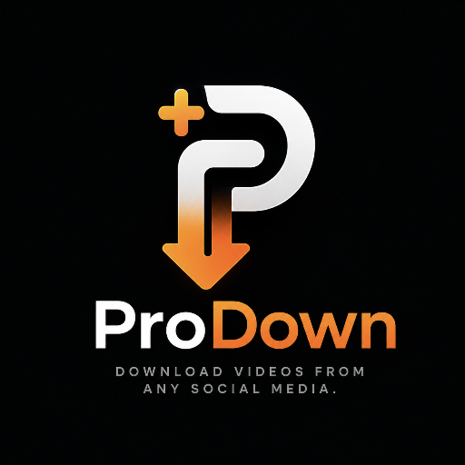

# 🚀 ProDown - Fast & Direct Social Media Video Downloader

**ProDown** is a high-performance, lightweight web application designed to extract and directly download media content from top social platforms with zero watermarks and original quality.



---

## ✨ Features

* **Direct iOS/Safari Popup Trigger**: Built-in Direct Blob Handling to trigger native Safari `"Do you want to download video.mp4?"` prompt on iOS devices.
* **5-in-1 Platform Support**: Seamless extraction for **TikTok**, **Instagram Reels**, **Facebook Videos**, **YouTube Shorts**, and **Snapchat Spotlights**.
* **No Watermarks**: Automatically extracts clean, original video files.
* **Modern UI/UX**: Sleek dark-mode aesthetic with custom Glassmorphism UI, responsive layout, and mobile drawer navigation.
* **Multi-Engine API Fallbacks**: Uses a fail-safe multi-endpoint strategy (TiklyDown & Cobalt Primary/Fallback proxies) to ensure maximum uptime.

---

## 📁 Directory Structure

```text
ProDown/
├── index.html              # Main HTML Application Interface
├── assets/
│   ├── css/
│   │   └── style.css       # Custom Glassmorphism Styles & Animations
│   ├── js/
│   │   └── app.js          # Direct Blob Extraction & UI Logic Engine
│   └── images/
│       ├── logo.png        # ProDown Application Logo
│       └── image.jpeg      # Developer Avatar
├── netlify.toml            # Netlify Redirects & Security Configuration
└── README.md               # Project Documentation
